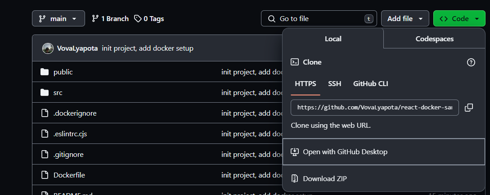

# React + TypeScript + Vite

This template provides a minimal setup to get React working in Vite with HMR and some ESLint rules.

# Installation

### Docker

You must have Docker installed. If you haven't installed Docker yet, please follow the instructions [here](https://docs.docker.com/get-docker/).

### Clone this repository using GitHub Desktop:



### Or clone it using Git CLI in your working directory:

```bash
gh repo clone VovaLyapota/react-docker-sandbox
```

---

# Development

### Local Development

To start developing locally, run the following commands:

```bash
npm i
npm run dev
```

After this you have to see localhost address:

```bash
$ npm run dev

> react-docker-sandbox@0.0.0 dev
> vite

Port 7777 is in use, trying another one...

VITE v5.1.6 ready in 224 ms

➜ Local: http://localhost:7778/
➜ Network: http://000.000.0.000:7778/
➜ Network: http://000.00.000.0:7778/
```

### To start develop with docker:

```bash
docker compose up --build --no-recreate
```

or

```bash
docker-compose up --build --no-recreate
```

After this you also have to see localhost address:

```bash
docker-react-c | ➜ Local: http:/localhost:7777/
docker-react-c | ➜ Network: http://000.00.00:7777/
```

---

### To stop development:

Press `Ctrl + C`

or

```bash
docker stop docker-react-c
```

### To delete docker container:

```bash
docker rm docker-react-c
```

### To delete docker image:

```bash
docker rmi docker-react-i
```
